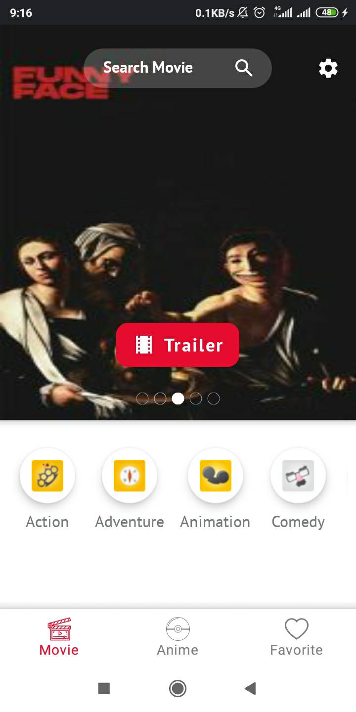
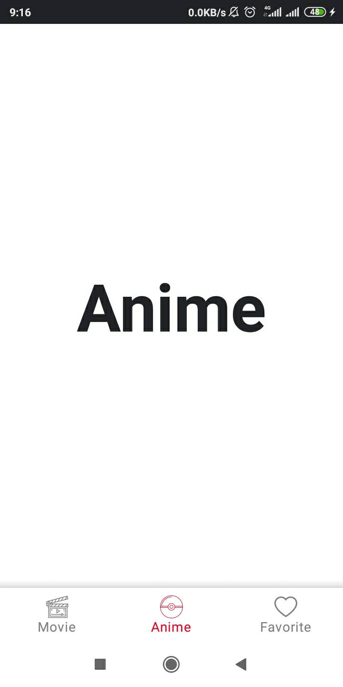
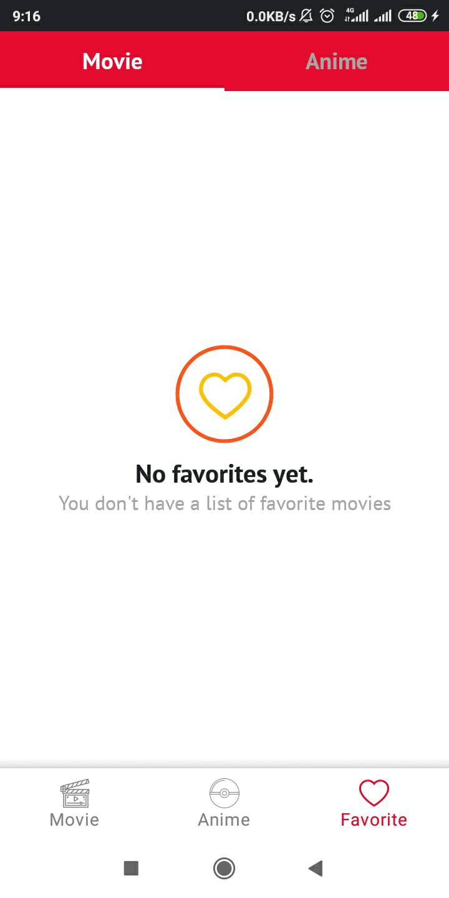
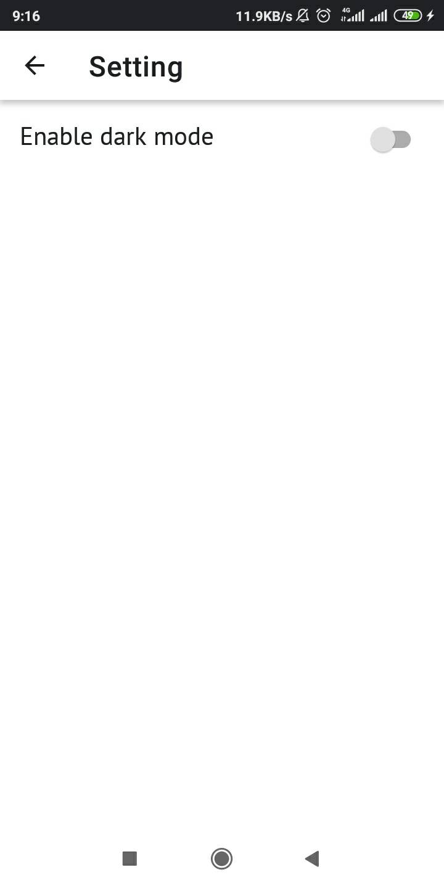

# Movie Catalog
Aplikasi kami merupakan aplikasi katalog film yang memberikan informasi terkait berbagai film dan anime. Aplikasi kami memiliki tiga fitur utama, pertama adalah katalog film, kedua adalah katalog anime, dan ketiga adalah favorites list dimana pengguna dapat membuat daftar film dan anime kesukaan pengguna. Aplikasi kami juga menerapkan fitur dark mode yang dapat membuat pengguna nyaman menggunakan aplikasi kami pada kondisi malam hari atau kurang cahaya.
## Instalasi
```bash
https://github.com/naufalirfani/papb-team8.git
```

## Fitur-fitur Aplikasi
- Katalog Movie


- Katalog Anime


- Favorites List


- Dark Mode


## Garis Besar Lifecycle Aplikasi
- onCreate()
onCreate terpanggil ketika sistem pertama kali membuat Activity. Pada aplikasi kami dapat ditemukan ketika aplikasi pertama dijalankan dan bisa juga setelah mengubah konfigurasi dark mode dimana aplikasi akan dihancurkan dan setelah sistem membuat instance baru, onCreate akan dipanggil kembali. 
- onPause()
onPause terpanggil ketika pengguna meninggalkan Activity (pengguna menekan tombol home pada smartphone, jadi Activity meninggalkan foreground). Pada aplikasi kami ditemukan ketika pengguna sedang menonton trailer dari film yang dipilih, ketika pengguna menekan tombol home kemudian onPause terpanggil dan durasi trailer akan tersimpan.
- onResume()
onResume terpanggil ketika pengguna kembali ke Activity dimana Activity kembali ke foreground. Pada aplikasi kami onResume ditemukan ketika pengguna kembali ke aplikasi, yang tadi sedang memutar trailer film, durasi akan tetap sama dan pengguna dapat melanjutkan menonton trailer tanpa harus mengulang dari awal lagi.

- onDestroy()
onDestroy terpanggil sesaat sebelum aplikasi dihancurkan. Dalam aplikasi kami onDestroy digunakan karena terjadi perubahan konfigurasi yaitu perubahan pengaturan dark mode. Jadi untuk berubah dari light mode menjadi dark mode maupun sebaliknya, aplikasi harus menghancurkan Activity dan sistem langsung membentuk instance baru dan memanggil kembali onCreate dengan konfigurasi baru.

## Alasan Pemilihan Arsitektur MVVM
Alasan kenapa kami memilih menggunakan arsitektur MVVM karena dengan menggunakan arsitektur MVVM, kode yang kami buat dapat termodularisasi dengan lebih baik. Tidak seperti ketika menggunakan MVP dimana View akan selalu bergantung pada Presenter ketika ada perubahan data. Dengan menggunakan MVVM View dapat mengolah data secara langsung dengan logika bisnis yang terpisah dari logika bisnis utama aplikasi, menghasilkan logika bisnis utama aplikasi yang lebih ringkas dan memudahkan debugging maupun pemeliharaan karena modularisasi kode tersebut.

Kami juga melihat dalam pemanfaatan API akan lebih mudah bila menggunakan arsitektur MVVM dibandingkan dengan MVP.


## Contributing
When contributing to this repository, please first discuss the change you wish to make via issue, email, or any other method with the owners of this repository before making a change

## Authors
- [Naufal Irfani](https://github.com/naufalirfani)
- [Ariq Athallah](https://github.com/ariqathallah)
- [Denzel Laimena](https://github.com/denzellaimena)

## License
This project is licensed under the [MIT](https://choosealicense.com/licenses/mit/) License.
